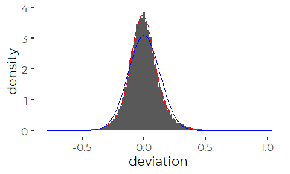
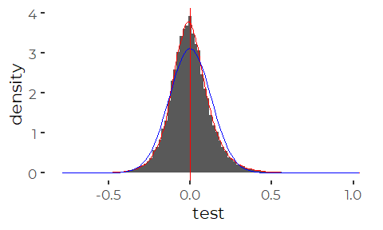
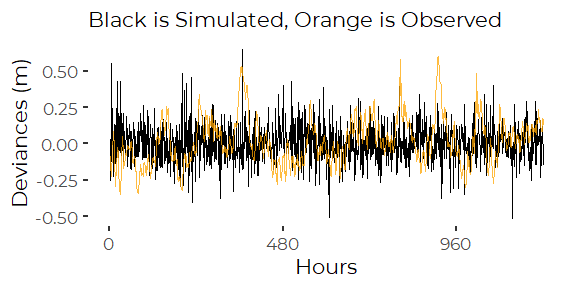

How Will SLR Increase Risk of Tidal flooding?
================
Curtis C. Bohlen
December 16, 2020

  - [Introduction](#introduction)
  - [Import Libraries](#import-libraries)
  - [Import Data](#import-data)
      - [Combine Data](#combine-data)
  - [Reprise the MGS Analysis](#reprise-the-mgs-analysis)
  - [Cleanup](#cleanup)
  - [Prepare Data for Simulations](#prepare-data-for-simulations)
      - [Calculate Difference between Predicted and
        Observed](#calculate-difference-between-predicted-and-observed)
      - [A problem](#a-problem)
      - [Focus on Official Tidal Epoch](#focus-on-official-tidal-epoch)
      - [Distribution of Deviations](#distribution-of-deviations)
  - [The Distribution of Deviations](#the-distribution-of-deviations)
      - [Skewness](#skewness)
      - [Kurtosis](#kurtosis)
      - [Conclusion](#conclusion)
  - [Temporal Autocorrelation](#temporal-autocorrelation)
      - [Conclusions](#conclusions)
  - [Resampling Analysis](#resampling-analysis)
      - [Testing a Resampled Simulation of
        Deviations](#testing-a-resampled-simulation-of-deviations)
      - [Resampling Function](#resampling-function)
      - [Test](#test)
      - [Run Results](#run-results)
  - [ARIMA Analysis](#arima-analysis)
      - [Developing an ARIMA model](#developing-an-arima-model)
      - [Testing an ARIMA Simulation of
        Deviations](#testing-an-arima-simulation-of-deviations)
      - [Simulation Function](#simulation-function)
      - [Test](#test-1)
      - [Run Results](#run-results-1)
      - [Direct Computation](#direct-computation)
      - [Resampling](#resampling)
      - [ARIMA](#arima)


# Introduction

One reviewer of our draft Climate Change chapter pointed out that for
all weather-related events, we presented data on the changing frequency
of “events” over time, including hot days, cold days, large storms, etc.
They suggested we show similar graphics showing changes in frequency of
tidal flooding events. We prepared that graphic in
[Tidal\_Flooding\_Events.Rmd](Graphics/Tidal_Flooding_Events.Rmd%5D).

In this notebook, we to put that graphic in context by looking at
estimates of future tidal flooding risk under a few SLR scenarios. Our
goal is to be able to say that analysis or simulation suggests an x%
increase in frequency of flooding with a Y foot increase in SLR.

In our analysis, we follow Maine Geological Survey’s practice of
declaring a tidal flooding event whenever tidal observations exceed the
current “Highest Astronomical Tide” or HAT level, which is 11.95 feet,
or 3.640 meters, above mean lower low water (MLLW) at Portland.

Maine Geological Survey has estimated future flooding risk by adding a
SLR value (0.8 foot and 1.5 feet) to the historical record, and showing
how frequent flooding would have been under SLR conditions. This
provides a ready estimate of impact of SLR on frequency of flooding.
They do not appear to provide quantitative estimates of change of
frequency of flooding.

Details of their method and a data viewer for different locations in
Maine are available at the [Maine Geological Survey sea level rise data
viewer](https://mgs-collect.site/slr_ticker/slr_dashboard.html).

We initially repeat their analysis for selected SLR scenarios ourselves,
over a fixed period of time (the past 20 years) and estimate percentage
change in flooding under one foot, two foot, and three foot SLR.

We also simulate flooding histories based on the 19 year tidal epoch,
and examining predicted flood frequencies using three different models
under three different SLR scenarios.

# Import Libraries

``` r
library(tidyverse)
#> -- Attaching packages --------------------------------------- tidyverse 1.3.0 --
#> v ggplot2 3.3.2     v purrr   0.3.4
#> v tibble  3.0.4     v dplyr   1.0.2
#> v tidyr   1.1.2     v stringr 1.4.0
#> v readr   1.4.0     v forcats 0.5.0
#> -- Conflicts ------------------------------------------ tidyverse_conflicts() --
#> x dplyr::filter() masks stats::filter()
#> x dplyr::lag()    masks stats::lag()
library(readr)

library(moments)  # for skewness and kurtosis; we could calculate, but why?
library(forecast) #for auto.arima()
#> Registered S3 method overwritten by 'quantmod':
#>   method            from
#>   as.zoo.data.frame zoo

library(CBEPgraphics)
load_cbep_fonts()
theme_set(theme_cbep())
```

# Import Data

Our primary source data is hourly data on observed and predicted water
levels at the Portland tide station (Station 8418150). We accessed these
data using small python scripts to download and assemble consistent data
from the NOAA Tides and Currents API. Details are provided in the
“Original Data” folder.

``` r
sibfldnm <- 'Original Data'
parent <- dirname(getwd())
sibling <- file.path(parent,sibfldnm)

#dir.create(file.path(getwd(), 'figures'), showWarnings = FALSE)
```

``` r
fn <- 'portland_tides_hourly.csv'
fpath <- file.path(sibling, fn)

observed_data  <- read_csv(fpath, col_types = cols(Time = col_time('%H:%M'))) %>%
  rename(MLLW = `Water Level`,
         theDate =`Date`) %>%
  mutate(Year = as.numeric(format(theDate, '%Y')),
         MLLW_ft = MLLW * 3.28084,
         Exceeds = MLLW > 3.640)
```

``` r
fn <- 'portland_tides_hourly_predicts.csv'
fpath <- file.path(sibling, fn)

predict_data  <- read_csv(fpath, col_types = cols(Time = col_time('%H:%M'))) %>%
  rename(theDate =`Date`) %>%
  mutate(Hour  = as.numeric(format(DateTime, '%H')),
         Month = as.numeric(format(theDate, '%m')),
         Day   = as.numeric(format(theDate, '%d')),
         Year  = as.numeric(format(theDate, '%Y'))) %>%
  select(-DateTime, -theDate, -Time)
```

## Combine Data

The number of predicted and observed values are not **quite** the same,
so we need to make sure we merge data appropriately. We merge by Year,
Month, Day, and Hour. We could use DateTime, but we have not checked if
both files use the same conventions throughout. This is likely more
robust.

``` r
combined <- observed_data %>%
  mutate(Hour  = as.numeric(format(DateTime, '%H')),
         Month = as.numeric(format(theDate, '%m')),
         Day   = as.numeric(format(theDate, '%d')),
         Year  = as.numeric(format(theDate, '%Y'))) %>%
  select(-Sigma, -MLLW_ft, -Exceeds) %>%
  inner_join(predict_data)
#> Joining, by = c("Year", "Hour", "Month", "Day")
```

# Reprise the MGS Analysis

We reprise the analysis conducted by Maine Geological Survey. MGS added
fixed estimates of SLR to the historic record, and counted hours of time
with coastal flooding.

We calculate hours with coastal flooding under different SLR scenarios
(following the logic used by MGS) , and then count days in which
flooding occurs.

We elaborate on methods developed for producing graphics showing daily
frequency of historic flood events. Here we look at the impact of
moderate SLR on coastal flooding compared to the frequency of coastal
flooding observed over the past 20 years.

``` r
slr_annual <- observed_data %>%
  filter(Year> 1999) %>%
  mutate(slr_1 = MLLW_ft + 1,
         slr_2 = MLLW_ft + 2,
         slr_3 = MLLW_ft + 3,
         exceeds_0 = MLLW_ft > 11.95, 
         exceeds_1 = slr_1   > 11.95,
         exceeds_2 = slr_2   > 11.95,
         exceeds_3 = slr_3   > 11.95) %>%
  group_by(theDate) %>%
  summarize(Year = first(Year),
            exceeded_0 = any(exceeds_0, na.rm = TRUE),
            exceeded_1 = any(exceeds_1, na.rm = TRUE),
            exceeded_2 = any(exceeds_2, na.rm = TRUE),
            exceeded_3 = any(exceeds_3, na.rm = TRUE),
            n = sum(! is.na(Exceeds)),
            .groups = 'drop') %>%
  group_by(Year) %>%
  summarize(Days = n(),
            floods_0 = sum(exceeded_0),
            floods_1 = sum(exceeded_1),
            floods_2 = sum(exceeded_2),
            floods_3 = sum(exceeded_3),
            .groups = 'drop')
```

``` r
summ <- slr_annual%>%
  summarize(across(contains('floods'), mean, na.rm = TRUE))
```

That suggests a change in flooding frequency on the order of 8.6 with
one foot of SLR.

# Cleanup

``` r
rm(slr_annual, summ)
```

# Prepare Data for Simulations

## Calculate Difference between Predicted and Observed

``` r
combined <- combined %>%
  mutate(deviation = MLLW - Prediction)
```

## A problem

There is a long-term trend in the value of the deviations.

``` r
ggplot(combined, aes(DateTime, deviation)) +
  geom_point(size = 0.01, alpha = 0.05, color = 'yellow') +
  geom_smooth(method = 'lm')
#> `geom_smooth()` using formula 'y ~ x'
#> Warning: Removed 22718 rows containing non-finite values (stat_smooth).
#> Warning: Removed 22718 rows containing missing values (geom_point).
```


So we have a problem. Tidal “Predictions” are based on harmonic
constituents, and thus do not take into account trends in sea level.
Deviations from tidal predictions are not stationary. That is a problem
for many forms of time series analysis.

Tidal predictions, strictly speaking, are defined in terms of a specific
19 year long tidal epoch, from 1983 through 2001. (The same is true for
the reported tidal datums for the Portland gage).

The tidal epoch is the period by NOAA to calculate tidal predictions,
which are based on a complex periodic function that is parameterized by
“harmonic constituents”, themselves calculated based on observed tidal
elevations over that 19 year period.

Thus during that period, the net error of prediction should be zero (or
very close to zero). Our best understanding of the distribution of
deviations from (astronomical) predicted tide elevations, therefore,
would come from looking at deviations during that tidal epoch, when
changes due to sea level are minimized.

The current tidal epoch for Portland is 1983-2001. (According to the
NOAA web page for the station: the epoch is provided on the datums
sub-page.)

## Focus on Official Tidal Epoch

A tidal epoch is nineteen years long, and represents the period over
which the astronomical alignments of sun, moon, and earth repeat (at
least closely enough for tidal prediction).

We focus on the 19 year period from 1983 through 2001, which corresponds
to the official tidal epoch for the Portland tide gage. Data from that
period was used to calculate the harmonic constituents used to predict
tide elevations, so differences between observed and predicted tidal
elevations have mean very near zero. Because of sea level rise, the
differences for more recent years have non-zero mean.

``` r
combined <- combined %>%
  filter(Year> 1982 & Year < 2002)

unique(combined$Year)
#>  [1] 1983 1984 1985 1986 1987 1988 1989 1990 1991 1992 1993 1994 1995 1996 1997
#> [16] 1998 1999 2000 2001
```

``` r
test <- lm(deviation ~ Year, data = combined)
coef(test)
#>   (Intercept)          Year 
#> -1.4898302622  0.0007476803
```

We do not show error estimates of this regression seriously, as
observations are highly inter-correlated, and estimated error would be
misleading, but the slope is meaningful. While this cavalier analysis
provides no basis for determining if the slope is statistically
meaningful, at \(7.5 \times 10^{-4}\) per year, the slope amounts to
about a millimeter over the nineteen year period of the tidal epoch, and
thus is, for practical purposes, safe to ignore.

## Distribution of Deviations

Values are in meters.

``` r
ggplot(combined, aes(deviation)) +
  geom_histogram(bins = 100) +
  geom_vline (xintercept = 0, color = 'red')
#> Warning: Removed 1384 rows containing non-finite values (stat_bin).
```


So, deviations are close to normally distributed, with mean close to
zero. I am certain that the mean close to zero is not by chance, but the
nearly normal distribution reflects something about the nature of
atmospheric and other non-astronomical effects on local sea level.

``` r
mean(combined$deviation)
#> [1] NA
sd(combined$deviation, na.rm = TRUE)
#> [1] 0.1283451
```

# The Distribution of Deviations

Formal statistical tests will do us little good here. With this much
data, nothing ever matches theoretical distributions exactly. This is a
matter for judgment, not testing.

## Skewness

``` r
skewness(combined$deviation, na.rm=TRUE)
#> [1] 0.4148183
```

A non-zero skew means the distribution is not symmetrical about its
mean. A positive skew suggests a few extra observations below the mean,
and a few extreme observations above the mean. The median is lower than
the mean. The upper tail is longer than the lower tail.

This observed level of skewness is not extreme, but it’s real.

We can confirm that somewhat more observations are below then mean than
above.

``` r
below <- sum(combined$deviation < mean(combined$deviation, na.rm = TRUE),
             na.rm = TRUE)
above <- sum(combined$deviation > mean(combined$deviation, na.rm = TRUE),
             na.rm = TRUE)

below
#> [1] 85734
above
#> [1] 79442

below/(below+above)
#> [1] 0.5190464
```

So we have a couple of percent more points below the mean than a normal
distribution. We must have a few more extreme values above the mean to
balance the distribution about the mean.

## Kurtosis

``` r
kurtosis(combined$deviation, na.rm = TRUE)
#> [1] 5.562658
```

Positive kurtosis suggests a “fat tailed” distribution. That is, there
are more observations in the tails of the distribution than would be
true of a normal distribution with similar standard deviation. To
balance the standard deviation out, those extreme values (more
correctly, the probability density for extreme values) can’t reach quite
as far from the mean as would be expected under a normal distribution.

## Conclusion

We are interested in the extremes of this distribution – or the
frequency of those extremes. The effects of skewness and  
kurtosis on frequency of extreme values work against each other, so it
is entirely possible that simulation with a normal distribution would
not be dreadful in this case, but we can not be sure.

distribution may not be appropriate. We probably need to either use a
distribution where we can tune the skewness (and possible the kurtosis),
or resample from the observed distribution of deviations.

# Temporal Autocorrelation

``` r
acf(combined$deviation, na.action = na.pass)
```


So, we see high autocorrelation, with a 12 hour (tidal) cycle imposed
over a very gradual decay. It’s not obvious whether that 12 hour pattern
is physical or a mathematical artifact of how the predicted tides are
calculated.

``` r
pacf(combined$deviation, na.action = na.pass)
```


## Conclusions

Autocorrelations and partial autocorrelations are high, with some
quasi-periodicity at weird 7 hour and 14 hour intervals This is a
complex time series. We can’t assume a simulation that does not address
autocorrelation will be adequate.

# Resampling Analysis

Here we: 1. Start with predicted tides from the official tidal epoch (in
meters) 2. Add (or not) a sea level rise value to the predicted tides 3.
Add a random deviation from predicted, resampled from hourly deviations
from astronomical tide from the tidal epoch. 4. Count up the number of
days with simulated flood events over the tidal epoch, and divide by
365.25 to estimate floods per year.

We simulate 1000 mock tidal epochs, and look at properties of the
resulting distribution of estimated rates of flooding per year.

## Testing a Resampled Simulation of Deviations

We can simulate a “random” time series by resampling from observed
values of the deviation between predicted and observed tidal levels.

``` r
tmp <-  combined$deviation[! is.na(combined$deviation)] # don't sample NAs
test <- sample(tmp, length(combined$deviation), replace = TRUE)
```

``` r
ggplot() + geom_histogram(aes(x = test), bins = 100)
```



Lets look at the moments of the simulated data. (Results will vary; this
is a simulation).

``` r
mean(test)
#> [1] -0.0005335074
sd(test)
#> [1] 0.1280491
skewness(test)
#> [1] 0.4113332
kurtosis(test)
#> [1] 5.408869
```

Moments are remarkably similar to source data, as would be expected.

``` r
ggplot() +
  geom_line(aes(x = (1:(24*50)), y = combined$deviation[1:(24*50)]),
            color = 'orange', alpha = 0.5) +
  geom_line(aes(x = (1:(24*50)), y = test[1:(24*50)])) +
   
  scale_x_continuous(breaks = seq(0, 24*100, 24*20)) +
  ylab('Deviances (m)') +
  xlab('Hours') +
  labs(subtitle = 'Black is Simulated, Orange is Observed')
```


The is a **lot** more temporal structure in the original data than in
the simulated data.

## Resampling Function

This is the workhorse function that carries out the steps just described
(except the repeat sampling).

``` r
resample_once <- function(dat, pr_sl, dev, dts, slr) {
  
  # We quote data variables, and look them up by name
  # Caution:  there is no error checking.
  pr_sl <- as.character(ensym(pr_sl))
  dev <- as.character(ensym(dev))
  dts <- as.character(ensym(dts))
  
  tmp <-  dat[[dev]]
  tmp <-  tmp[! is.na(tmp)]
  #Simulate one tidal epoch of hourly tidal elevations
  val <- dat[[pr_sl]] + slr + sample(tmp,
                                     length(dat[[pr_sl]]),
                                     replace = TRUE)
  
  #create a dataframe, for convenient calculations
  df <- tibble(theDate = dat[[dts]], sim = val)
  
  #Calculate results
  res <- df %>%
    group_by(theDate)  %>%
    summarize(exceeded = any(sim > 3.640),
              .groups = 'drop') %>%
    summarize(days = sum(! is.na(exceeded)),
              floods = sum(exceeded, na.rm = TRUE),
              floods_p_yr = 365.25 * floods/days) %>%
    pull(floods_p_yr)
  
  return(res)
}
```

## Test

``` r
resample_once(combined, Prediction, deviation, theDate, 0)
#> [1] 6.105043
```

## Run Results

the following takes about thirty seconds to run.

``` r
set.seed(12345)
samp = 1000
res <- numeric(samp)
for (iter in seq(1, samp)) {
  res[[iter]] <- resample_once(combined, Prediction, deviation, theDate, 0)
}
```

``` r
mean(res)
#> [1] 6.038519
sd(res)
#> [1] 0.5149271
```

``` r
ggplot() +
  geom_histogram(aes(x = res, y = ..density..)) +
  geom_density(aes(x = res), color = 'red') +
  stat_function(fun = dnorm, args = list(mean = mean(res), sd = sd(res)),
                color = 'blue')
#> `stat_bin()` using `bins = 30`. Pick better value with `binwidth`.
```


# ARIMA Analysis

The prior analysis did not take into account the temporal
autocorrelation of deviations from predicted tidal heights. In this
section, we take a similar simulation approach, but simulate a slightly
more faithful representation of the distribution of deviations from
predicted tidal heights, by simulating an ARIMA process.

## Developing an ARIMA model

We can fit an ARIMA model to the tidal deviations data, and then
simulate random deviations based on the parameters we find. We fit an
ARIMA model using the `auto.arima()` function from the `forcast`
package.

By definition, the observed deviations are stationary, with mean zero,
so we need not do any preliminary differencing. We signal that to
`auto.arima()` with d = 0.

This takes around 20 seconds to run.

``` r
my_arima <- auto.arima(combined$deviation, d = 0)
#my_arima
(my_coefs <- coef(my_arima))
#>         ar1         ar2         ar3         ar4         ar5 
#>  1.17564061 -0.26121524  0.24867580 -0.30207238  0.08292214
(my_sigma2 <- my_arima$sigma2)
#> [1] 0.001210982
```

## Testing an ARIMA Simulation of Deviations

We can simulate a “random” time series that matches the estimated ARIMA
structure of the observed deviations using `arima.sim()`.

``` r
test <- arima.sim(n = 365*24,
                  model = list(ar = my_coefs),
                  sd = sqrt(my_sigma2))
```

``` r
ggplot() + geom_histogram(aes(x = test), bins = 100)
#> Don't know how to automatically pick scale for object of type ts. Defaulting to continuous.
```


The range of simulations is perhaps a little narrower than the observed
data, but since we simulated only 1/20 the data, that is not surprising.

Lets look at the moments of the simulated data. (Results will vary; this
is a simulation)

``` r
mean(test)
#> [1] 0.006795336
sd(test)
#> [1] 0.132654
skewness(test)
#> [1] 0.03278123
kurtosis(test)
#> [1] 2.921464
```

Mean and SD are excellent fits. Both skewness and kurtosis are lower
than the historical data, but not too far off.

``` r
ggplot() +
  geom_line(aes(x = (1:(24*100)), y = combined$deviation[1:(24*100)]),
            color = 'orange', alpha = 0.5) +
  geom_line(aes(x = (1:(24*100)), y = test[1:(24*100)])) +
   
  scale_x_continuous(breaks = seq(0, 24*100, 24*20)) +
  ylab('Deviances (m)') +
  xlab('Hours') +
  labs(subtitle = 'Black is Simulated, Orange is Observed')
```


So the autocorrelation structure at least looks roughly comparable.
There may be slightly more long-term structure in the observed data, but
we’re not far off.

## Simulation Function

``` r
sim_once <- function(dat, pr_sl, dev, dts, slr) {
  
  # We quote data variables, and look them up by name
  # Caution:  there is no error checking.
  
  pr_sl <- as.character(ensym(pr_sl))
  dev <- as.character(ensym(dev))
  dts <- as.character(ensym(dts))
  
  #Simulate one tidal epoch of hourly tidal elevations
  val <- dat[[pr_sl]] + slr + arima.sim(n = length(dat[[pr_sl]]),
                                 model = list(ar = my_coefs),
                                 sd = sqrt(my_sigma2))
  
  #create a dataframe, for convenient calculations
  df <- tibble(theDate = dat[[dts]], sim = val)
  
  #Calculate results
  res <- df %>%
    group_by(theDate)  %>%
    summarize(exceeded = any(sim > 3.640),
              .groups = 'drop') %>%
    summarize(days = sum(! is.na(exceeded)),
              floods = sum(exceeded, na.rm = TRUE),
              floods_p_yr = 365.25 * floods/days) %>%
    pull(floods_p_yr)
  
  return(res)
} 
```

## Test

``` r
sim_once(combined, Prediction, deviation, theDate, 0)
#> [1] 4.420893
```

## Run Results

the following takes just over a minutes to run.

``` r
set.seed(54321)
samp = 1000
res <- numeric(samp)
for (iter in seq(1, samp)) {
  res[[iter]] <- sim_once(combined, Prediction, deviation, theDate, 0)
}
```

``` r
mean(res)
#> [1] 4.297687
sd(res)
#> [1] 0.4760195
```

Estimated number of flood days per year is slightly lower, and actually
in better agreement with the observed number during the official tidal
epoch.

Results are close to normally distributed, but better reflect the

``` r
ggplot() +
  geom_histogram(aes(x = res, y = ..density..), bins = 50) +
  geom_density(aes(x = res), color = 'red') +
  stat_function(fun = dnorm, args = list(mean = mean(res), sd = sd(res)),
                color = 'blue')
```


\# Wrapping it all up How much will SLR increase the frequency of days
with flooding? We compare three methods. In all cases, we focus on the
period of the tidal epoch, when difference between observed and
predicted tides were minimized. That makes these results only
qualitatively related to change in frequency of flooding compared to
recent times.

## Direct Computation

Following the MGS method, but focused on the same period as our
simulations for comparison purposes. Note these results are VERY
different from results for the last ten years, and in fact make the
increase in flooding frequency look much more severe.

``` r
slr_annual <- observed_data %>%
  filter(Year> 1982 & Year < 2002) %>%
  mutate(slr_1 = MLLW_ft + 1,
         slr_2 = MLLW_ft + 2,
         slr_3 = MLLW_ft + 3,
         exceeds_0 = MLLW_ft > 11.95, 
         exceeds_1 = slr_1   > 11.95,
         exceeds_2 = slr_2   > 11.95,
         exceeds_3 = slr_3   > 11.95) %>%
  group_by(theDate) %>%
  summarize(exceeded_0 = any(exceeds_0, na.rm = TRUE),
            exceeded_1 = any(exceeds_1, na.rm = TRUE),
            exceeded_2 = any(exceeds_2, na.rm = TRUE),
            exceeded_3 = any(exceeds_3, na.rm = TRUE),
            .groups = 'drop') %>%
  
  summarize(days = sum(! is.na(exceeded_0)),
            floods_p_yr_0 = 365.25 * sum(exceeded_0)/days,
            floods_p_yr_1 = 365.25 * sum(exceeded_1)/days,
            floods_p_yr_2 = 365.25 * sum(exceeded_2)/days,
            floods_p_yr_3 = 365.25 * sum(exceeded_3)/days,
            ratio_1 = floods_p_yr_1 / floods_p_yr_0,
            ratio_2 = floods_p_yr_2 / floods_p_yr_0,
            ratio_3 = floods_p_yr_3 / floods_p_yr_0,
            .groups = 'drop') %>%
  select(-days)
slr_annual
#> # A tibble: 1 x 7
#>   floods_p_yr_0 floods_p_yr_1 floods_p_yr_2 floods_p_yr_3 ratio_1 ratio_2
#>           <dbl>         <dbl>         <dbl>         <dbl>   <dbl>   <dbl>
#> 1          2.05          45.4          160.          310.    22.1    77.7
#> # ... with 1 more variable: ratio_3 <dbl>
```

## Resampling

Create a function to allow us to use `map()` or `lapply()` to assemble
results.

These are partial functions, since they relay on the existence of a
dataframe called "combined, with appropriate data columns.

``` r
res_auto <- function(slr, samp) {
  res <- numeric(samp)
  for (iter in seq(1, samp))
    res[[iter]] <- resample_once(combined, Prediction, deviation, theDate, slr)
  return(res)
}
  
```

``` r
set.seed(12345)
samp = 1000
resamp <- lapply((0:3 * 0.3048), function(x) res_auto(x, samp))
```

``` r
names(resamp) = c('No SLR', 'One Foot SLR', 'Two Foot SLR', 'Three Foot SLR')
resamp <- do.call(bind_cols, resamp)

resamp <- resamp %>% 
  summarize(across(everything(), mean, na.rm = TRUE)) %>%
  rowwise() %>%
  mutate(`One Foot`   = round(`One Foot SLR`/`No SLR`,3),
         `Two Foot`   = round(`Two Foot SLR`/`No SLR`,3),
         `Three Foot` = round(`Three Foot SLR`/`No SLR`,3))
resamp
#> # A tibble: 1 x 7
#> # Rowwise: 
#>   `No SLR` `One Foot SLR` `Two Foot SLR` `Three Foot SLR` `One Foot` `Two Foot`
#>      <dbl>          <dbl>          <dbl>            <dbl>      <dbl>      <dbl>
#> 1     6.04           61.9           191.             336.       10.2       31.7
#> # ... with 1 more variable: `Three Foot` <dbl>

v <- resamp$`One Foot` 
```

We can conclude that under this model, one foot of SLR will increase the
frequency of flooding by something on the order of a factor of 10.2 .
The analysis is conservative, to the extent that it is based on sea
level observations during the tidal epoch, which ended twenty years ago.
The ration of increased flooding, however, is likely to be similar.

## ARIMA

We use the same approach here.

``` r
sim_auto <- function(slr, samp) {
  res <- numeric(samp)
  for (iter in seq(1, samp))
    res[[iter]] <- sim_once(combined, Prediction, deviation, theDate, slr)
  return(res)
}
  
```

The following takes several minutes to run.

``` r
set.seed(12345)
samp = 1000
simulates <- lapply((0:3 * 0.3048), function(x) sim_auto(x, samp))
```

``` r
names(simulates) = c('No SLR', 'One Foot SLR', 'Two Foot SLR', 'Three Foot SLR')
simulates <- do.call(bind_cols, simulates)

simulates <- simulates %>%
  summarize(across(everything(), mean, na.rm = TRUE)) %>%
  rowwise() %>%
  mutate(`One Foot`   = round(`One Foot SLR`/`No SLR`,3),
         `Two Foot`   = round(`Two Foot SLR`/`No SLR`,3),
         `Three Foot` = round(`Three Foot SLR`/`No SLR`,3))
simulates
#> # A tibble: 1 x 7
#> # Rowwise: 
#>   `No SLR` `One Foot SLR` `Two Foot SLR` `Three Foot SLR` `One Foot` `Two Foot`
#>      <dbl>          <dbl>          <dbl>            <dbl>      <dbl>      <dbl>
#> 1     4.31           52.2           172.             319.       12.1       39.8
#> # ... with 1 more variable: `Three Foot` <dbl>

v <- simulates$`One Foot`
```

This analysis suggests a one foot sea level rise would increase flooding
by a factor of about 12.1.
